# Blueprint Navigation Flow - Before & After Fix

## 🔴 Before Fix (Broken - 404 Error)

```mermaid
graph TD
    A[User clicks "檢視" button] --> B[blueprint-list.component.ts]
    B --> C[router.navigate<br/>['/blueprint', id]]
    C --> D[URL: /blueprint/abc-123]
    D --> E{Route Match?}
    E -->|NO MATCH| F[404 Error ❌]
    
    style F fill:#f88,stroke:#f00,stroke-width:3px
    style D fill:#faa,stroke:#f00
```

### Problem
- Route config expects: `/blueprints/user/{id}` or `/blueprints/organization/{id}`
- Navigation produces: `/blueprint/{id}`
- Result: **No matching route → 404 Error**

---

## ✅ After Fix (Working - Correct Navigation)

### User Context Flow

```mermaid
graph TD
    A[User clicks "檢視" button] --> B[blueprint-list.component.ts]
    B --> C[Current URL:<br/>/blueprints/user]
    C --> D[router.navigate<br/>[id], {relativeTo: route}]
    D --> E[Resolved URL:<br/>/blueprints/user/abc-123]
    E --> F{Route Match?}
    F -->|MATCH ✓| G[blueprint-detail.component.ts]
    G --> H[Display Blueprint Details ✓]
    
    style H fill:#8f8,stroke:#0f0,stroke-width:3px
    style E fill:#afa,stroke:#0f0
```

### Organization Context Flow

```mermaid
graph TD
    A[User clicks "檢視" button] --> B[blueprint-list.component.ts]
    B --> C[Current URL:<br/>/blueprints/organization]
    C --> D[router.navigate<br/>[id], {relativeTo: route}]
    D --> E[Resolved URL:<br/>/blueprints/organization/abc-123]
    E --> F{Route Match?}
    F -->|MATCH ✓| G[blueprint-detail.component.ts]
    G --> H[Display Blueprint Details ✓]
    
    style H fill:#8f8,stroke:#0f0,stroke-width:3px
    style E fill:#afa,stroke:#0f0
```

---

## 🔄 Complete Navigation Architecture

```mermaid
graph TB
    subgraph "Main Routes"
        R1[/blueprints/user]
        R2[/blueprints/organization]
    end
    
    subgraph "Blueprint Routes (Lazy Loaded)"
        L1['' → List Component]
        L2[':id' → Detail Component]
        L3[':id/members' → Members Component]
        L4[':id/audit' → Audit Component]
    end
    
    subgraph "Navigation Methods"
        N1[Relative Navigation<br/>{ relativeTo: route }]
        N2[Parent Navigation<br/>['..'] + relativeTo]
    end
    
    R1 --> L1
    R2 --> L1
    L1 -->|View Button| N1
    N1 --> L2
    L2 -->|Breadcrumb| N2
    N2 --> L1
    L2 -->|Module Link| N1
    N1 --> L3
    N1 --> L4
    
    style N1 fill:#aaf,stroke:#00f
    style N2 fill:#aaf,stroke:#00f
    style L2 fill:#afa,stroke:#0f0
```

---

## 📊 Comparison Table

| Aspect | Before Fix (❌) | After Fix (✅) |
|--------|----------------|---------------|
| **Navigation Type** | Absolute path | Relative path |
| **Code** | `['/blueprint', id]` | `[id], { relativeTo: route }` |
| **User Context URL** | `/blueprint/abc-123` | `/blueprints/user/abc-123` |
| **Org Context URL** | `/blueprint/abc-123` | `/blueprints/organization/abc-123` |
| **Route Match** | ❌ No match | ✅ Matches config |
| **Result** | 404 Error | Correct page |
| **Context Aware** | ❌ No | ✅ Yes |
| **Maintainable** | ❌ Breaks on route changes | ✅ Flexible |

---

## 🎯 Key Benefits

### 1. Context Preservation
```typescript
// Automatically adapts to parent route
Current: /blueprints/user → Navigate to: /blueprints/user/{id}
Current: /blueprints/organization → Navigate to: /blueprints/organization/{id}
```

### 2. Flexible Architecture
```typescript
// If parent route changes from /blueprints/user to /my-blueprints
// No code changes needed - relative navigation still works!
```

### 3. Type Safety
```typescript
// TypeScript ensures route segments exist
this.router.navigate([blueprint.id], { relativeTo: this.route });
//                    ↑ Checked at compile time
```

### 4. Consistent Navigation
```typescript
// All navigation methods use the same pattern
- View blueprint: [id]
- Back to list: ['..']
- Module page: [module]
```

---

## 🧪 Testing Scenarios

```mermaid
graph LR
    subgraph "Test Scenario 1: User Context"
        T1A[Login as User] --> T1B[Go to My Blueprints]
        T1B --> T1C[Click View]
        T1C --> T1D[✓ URL: /blueprints/user/123]
        T1D --> T1E[Click Breadcrumb]
        T1E --> T1F[✓ URL: /blueprints/user]
    end
    
    subgraph "Test Scenario 2: Org Context"
        T2A[Switch to Org] --> T2B[Go to Org Blueprints]
        T2B --> T2C[Click View]
        T2C --> T2D[✓ URL: /blueprints/organization/456]
        T2D --> T2E[Click Back Button]
        T2E --> T2F[✓ URL: /blueprints/organization]
    end
    
    style T1D fill:#8f8
    style T1F fill:#8f8
    style T2D fill:#8f8
    style T2F fill:#8f8
```



---

## 📝 Code Changes Summary

### blueprint-list.component.ts

```diff
  import { Component, OnInit, inject, effect, computed } from '@angular/core';
- import { Router } from '@angular/router';
+ import { Router, ActivatedRoute } from '@angular/router';

  export class BlueprintListComponent implements OnInit {
    private readonly router = inject(Router);
+   private readonly route = inject(ActivatedRoute);

    view(record: STData): void {
      const blueprint = record as unknown as Blueprint;
-     this.router.navigate(['/blueprint', blueprint.id]);
+     this.router.navigate([blueprint.id], { relativeTo: this.route });
    }
  }
```

### blueprint-detail.component.ts

```diff
  <!-- Breadcrumb -->
- <a [routerLink]="['/blueprint']">藍圖管理</a>
+ <a [routerLink]="['..']" [relativeTo]="route">藍圖管理</a>

  <!-- Back Button -->
- <button [routerLink]="['/blueprint']">返回列表</button>
+ <button [routerLink]="['..']" [relativeTo]="route">返回列表</button>

  // Module Navigation
  openModule(module: string): void {
    const blueprintId = this.blueprint()?.id;
    if (blueprintId) {
-     this.router.navigate(['/blueprint', blueprintId, module]);
+     this.router.navigate([module], { relativeTo: this.route });
    }
  }
```

---

**Document Version**: 1.0  
**Last Updated**: 2025-12-10  
**Status**: ✅ Fix Implemented and Documented
