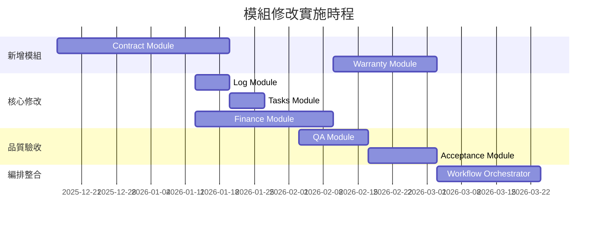

# 現有模組修改分析

> **文件版本**: 1.0.0  
> **分析日期**: 2025-12-15  
> **基於**: SETC 工作流程分析  
> **範圍**: 現有模組擴展與整合

---

## 📋 執行摘要

本文件分析基於 SETC 工作流程，哪些現有模組需要修改、如何修改、以及修改的優先順序。

### 修改概覽

**需要修改的模組**: 6 個
- Finance Module - 擴展 Invoice/Payment 子模組
- QA Module - 擴展 Defect Management
- Acceptance Module - 移除內嵌 Issue，整合 Issue Module API
- Workflow Module - 新增自動化編排器
- Tasks Module - 整合合約驗證與款項狀態
- Log Module - 整合自動建立機制

**需要強化整合的模組**: 3 個
- Audit Logs Module - 擴展稽核範圍
- Communication Module - 擴展通知機制
- Cloud Module - 擴展檔案管理

---

## 1. Finance Module 修改

### 1.1 修改概覽

| 屬性 | 值 |
|------|-----|
| Module ID | `finance` |
| Current Status | ⚠️ 部分實現 |
| Target Status | ✅ 完整實現 |
| Priority | P1（重要） |
| Estimated Effort | 3-4 週 |

### 1.2 當前狀態

**已實現**:
- ✅ 基礎模組結構
- ✅ Cost Management Service
- ✅ Budget Service
- ✅ Ledger Service
- ✅ Financial Report Service
- ✅ Invoice Service（基礎）
- ✅ Payment Service（基礎）

**缺少**:
- ❌ 請款單完整生命週期管理
- ❌ 付款單完整生命週期管理
- ❌ 審核流程整合
- ❌ 自動生成請款/付款清單
- ❌ 業主/承商分離的清單管理
- ❌ 可請款/可付款百分比計算
- ❌ 任務款項狀態自動更新

### 1.3 修改計畫

#### 擴展 Invoice Service

**新增功能**:

```typescript
// services/invoice.service.ts（擴展現有）

export class InvoiceService {
  // === 現有功能（保留）===
  
  // === 新增功能 ===
  
  /**
   * 自動生成請款單（從驗收記錄）
   */
  autoGenerateFromAcceptance(params: AutoInvoiceParams): Promise<Invoice> {
    // 1. 取得驗收相關的任務
    // 2. 計算可請款金額與百分比
    // 3. 建立請款單
    // 4. 發送事件
  }
  
  /**
   * 計算可請款百分比
   */
  calculateBillingPercentage(params: BillingCalculationParams): Promise<number> {
    // 基於合約條款、驗收狀態、已請款金額計算
  }
  
  /**
   * 提交請款單進入審核
   */
  submitForApproval(invoiceId: string): Promise<Invoice> {
    // 1. 驗證請款單完整性
    // 2. 變更狀態為 submitted
    // 3. 觸發審核流程（Workflow Module）
    // 4. 發送事件與通知
  }
  
  /**
   * 獲取待審核請款單
   */
  getPendingApproval(userId: string): Promise<Invoice[]> {
    // 查詢用戶需要審核的請款單
  }
  
  /**
   * 記錄付款
   */
  recordPayment(invoiceId: string, payment: PaymentRecord): Promise<Invoice> {
    // 1. 更新請款單狀態
    // 2. 記錄付款資訊
    // 3. 觸發任務款項狀態更新
    // 4. 更新成本管理
  }
}
```

**新增服務**:

```typescript
// services/invoice-generation.service.ts（新增）

export class InvoiceGenerationService {
  /**
   * 從驗收記錄自動生成請款單
   */
  async generateFromAcceptance(acceptanceId: string): Promise<Invoice> {
    const acceptance = await this.acceptanceRepo.findById(acceptanceId);
    const contract = await this.contractRepo.findById(acceptance.contractId);
    const tasks = await this.taskRepo.findByIds(acceptance.taskIds);
    
    // 計算可請款項目
    const invoiceItems = this.calculateInvoiceItems(contract, tasks, acceptance);
    
    // 計算請款百分比
    const billingPercentage = this.calculateBillingPercentage(contract, acceptance);
    
    // 建立請款單
    const invoice = await this.invoiceRepo.create({
      blueprintId: acceptance.blueprintId,
      contractId: contract.id,
      acceptanceId: acceptance.id,
      taskIds: acceptance.taskIds,
      invoiceType: 'receivable',
      invoiceItems,
      billingPercentage,
      status: 'draft',
      billingParty: contract.contractor,
      payingParty: contract.owner
    });
    
    // 發送事件
    this.eventBus.emit('INVOICE_GENERATED', { invoiceId: invoice.id });
    
    return invoice;
  }
  
  /**
   * 計算請款項目
   */
  private calculateInvoiceItems(
    contract: Contract,
    tasks: Task[],
    acceptance: Acceptance
  ): InvoiceItem[] {
    const items: InvoiceItem[] = [];
    
    for (const task of tasks) {
      // 找到對應的合約工項
      const workItem = contract.workItems.find(wi => wi.linkedTaskIds.includes(task.id));
      
      if (workItem) {
        // 計算已完成數量（基於驗收）
        const completedQuantity = this.calculateCompletedQuantity(task, acceptance);
        const amount = completedQuantity * workItem.unitPrice;
        
        items.push({
          id: generateId(),
          workItemId: workItem.id,
          description: workItem.name,
          unit: workItem.unit,
          quantity: completedQuantity,
          unitPrice: workItem.unitPrice,
          amount,
          completionPercentage: (completedQuantity / workItem.quantity) * 100,
          taskId: task.id,
          acceptanceId: acceptance.id
        });
      }
    }
    
    return items;
  }
  
  /**
   * 計算請款百分比
   */
  private calculateBillingPercentage(
    contract: Contract,
    acceptance: Acceptance
  ): number {
    // 根據合約條款與驗收狀態決定可請款比例
    // 例如：初驗通過 70%，驗收通過 90%，保固期滿 100%
    
    const terms = contract.terms.filter(t => t.category === 'payment');
    const acceptanceType = acceptance.requestType;
    
    if (acceptanceType === 'preliminary') {
      return 70; // 初驗通過 70%
    } else if (acceptanceType === 'final') {
      return 90; // 驗收通過 90%
    }
    
    return 100; // 預設 100%
  }
}
```

```typescript
// services/invoice-approval.service.ts（新增）

export class InvoiceApprovalService {
  /**
   * 開始審核流程
   */
  async startApprovalWorkflow(invoiceId: string): Promise<ApprovalWorkflow> {
    const invoice = await this.invoiceRepo.findById(invoiceId);
    
    // 建立審核工作流程
    const workflow = await this.workflowModule.createWorkflow({
      type: 'invoice_approval',
      entityId: invoiceId,
      steps: this.getApprovalSteps(invoice),
      autoAdvance: false
    });
    
    // 更新請款單
    await this.invoiceRepo.update(invoiceId, {
      status: 'under_review',
      approvalWorkflow: {
        workflowId: workflow.id,
        currentStep: 1,
        totalSteps: workflow.steps.length
      }
    });
    
    return workflow;
  }
  
  /**
   * 審核通過
   */
  async approve(invoiceId: string, approverId: string, comments?: string): Promise<void> {
    const invoice = await this.invoiceRepo.findById(invoiceId);
    
    // 記錄審核
    await this.workflowModule.advance(invoice.approvalWorkflow.workflowId, {
      action: 'approve',
      actorId: approverId,
      comments
    });
    
    // 檢查是否所有步驟完成
    const workflow = await this.workflowModule.getWorkflow(invoice.approvalWorkflow.workflowId);
    
    if (workflow.isCompleted) {
      // 全部審核通過，更新狀態
      await this.invoiceRepo.update(invoiceId, {
        status: 'approved'
      });
      
      // 發送事件
      this.eventBus.emit('INVOICE_APPROVED', { invoiceId });
    }
  }
  
  /**
   * 審核退回
   */
  async reject(invoiceId: string, approverId: string, reason: string): Promise<void> {
    await this.invoiceRepo.update(invoiceId, {
      status: 'rejected',
      rejectionReason: reason,
      rejectedBy: approverId,
      rejectedAt: new Date()
    });
    
    this.eventBus.emit('INVOICE_REJECTED', { invoiceId, reason });
  }
}
```

#### 擴展 Payment Service

**結構相同，實作類似 Invoice Service**

```typescript
// services/payment.service.ts（擴展）
// services/payment-generation.service.ts（新增）
// services/payment-approval.service.ts（新增）
// services/payment-tracking.service.ts（新增）
```

#### 新增資料模型

```typescript
// models/invoice.model.ts（擴展）

export interface Invoice {
  // === 現有欄位（保留）===
  
  // === 新增欄位 ===
  
  // 關聯
  contractId: string;
  acceptanceId?: string;
  taskIds: string[];
  
  // 請款項目
  invoiceItems: InvoiceItem[];
  
  // 金額
  subtotal: number;
  tax: number;
  total: number;
  
  // 請款百分比
  billingPercentage: number;
  accumulatedBilling: number;
  
  // 審核流程
  approvalWorkflow?: ApprovalWorkflow;
  
  // 付款資訊
  dueDate: Date;
  paidDate?: Date;
  paidAmount?: number;
  paymentMethod?: string;
  paymentReference?: string;
}

export interface InvoiceItem {
  id: string;
  workItemId: string;
  description: string;
  unit: string;
  quantity: number;
  unitPrice: number;
  amount: number;
  completionPercentage: number;
  taskId?: string;
  acceptanceId?: string;
}

export interface ApprovalWorkflow {
  workflowId: string;
  currentStep: number;
  totalSteps: number;
  approvers: Approver[];
  history: ApprovalHistory[];
}

export interface Approver {
  userId: string;
  userName: string;
  role: string;
  step: number;
  status: ApprovalStatus;
  approvedAt?: Date;
  comments?: string;
}
```

### 1.4 整合點

1. **Contract Module**
   - 獲取合約工項與金額
   - 獲取付款條款

2. **Acceptance Module**
   - 驗收通過後觸發請款生成
   - 提供驗收數量資料

3. **Tasks Module**
   - 付款完成後更新任務款項狀態
   - 提供任務完成資料

4. **Workflow Module**
   - 審核流程管理
   - 狀態轉換控制

### 1.5 Event Bus 事件

```typescript
export const FINANCE_MODULE_EVENTS = {
  // 請款事件
  INVOICE_GENERATED: 'finance.invoice_generated',
  INVOICE_SUBMITTED: 'finance.invoice_submitted',
  INVOICE_APPROVED: 'finance.invoice_approved',
  INVOICE_REJECTED: 'finance.invoice_rejected',
  INVOICE_PAID: 'finance.invoice_paid',
  
  // 付款事件
  PAYMENT_GENERATED: 'finance.payment_generated',
  PAYMENT_SUBMITTED: 'finance.payment_submitted',
  PAYMENT_APPROVED: 'finance.payment_approved',
  PAYMENT_REJECTED: 'finance.payment_rejected',
  PAYMENT_COMPLETED: 'finance.payment_completed',
  
  // 成本事件
  COST_UPDATED: 'finance.cost_updated',
  BUDGET_EXCEEDED: 'finance.budget_exceeded'
};
```

---

## 2. QA Module 修改

### 2.1 修改概覽

| 屬性 | 值 |
|------|-----|
| Module ID | `qa` |
| Current Status | ✅ 基礎實現 |
| Target Status | ✅ 完整實現 |
| Priority | P1（重要） |
| Estimated Effort | 2 週 |

### 2.2 修改重點

**擴展 Defect Service**

```typescript
// services/defect.service.ts（擴展）

export class DefectService {
  // === 新增功能 ===
  
  /**
   * 從 QC 檢查自動建立缺失單
   */
  async autoCreateFromInspection(params: DefectFromInspectionParams): Promise<Defect[]> {
    const inspection = await this.qaRepo.getInspection(params.inspectionId);
    const failedItems = inspection.checkResults.filter(r => r.result === 'failed');
    
    const defects: Defect[] = [];
    
    for (const item of failedItems) {
      const defect = await this.defectRepo.create({
        blueprintId: inspection.blueprintId,
        defectNumber: generateDefectNumber(),
        source: 'qc_inspection',
        sourceId: inspection.id,
        title: `QC 缺失: ${item.itemName}`,
        description: item.notes || `${item.itemName} 檢查不合格`,
        location: item.location || inspection.location,
        severity: this.determineSeverity(item),
        category: item.category,
        status: 'open',
        responsibleParty: inspection.contractorId,
        beforePhotos: item.photos || [],
        createdBy: inspection.inspectorId,
        createdAt: new Date()
      });
      
      defects.push(defect);
    }
    
    // 發送事件
    this.eventBus.emit('DEFECTS_CREATED_FROM_QC', {
      inspectionId: params.inspectionId,
      defectIds: defects.map(d => d.id)
    });
    
    return defects;
  }
  
  /**
   * 缺失整改
   */
  async resolveDefect(defectId: string, resolution: DefectResolution): Promise<Defect> {
    const defect = await this.defectRepo.update(defectId, {
      resolution,
      status: 'resolved',
      resolvedAt: new Date()
    });
    
    // 發送事件（觸發複驗）
    this.eventBus.emit('DEFECT_RESOLVED', { defectId, resolution });
    
    return defect;
  }
  
  /**
   * 缺失複驗
   */
  async reinspectDefect(defectId: string, reinspection: Reinspection): Promise<Defect> {
    const defect = await this.defectRepo.findById(defectId);
    
    // 新增複驗記錄
    const updatedDefect = await this.defectRepo.update(defectId, {
      reinspections: [...defect.reinspections, reinspection],
      status: reinspection.result === 'passed' ? 'verified' : 'in_progress'
    });
    
    // 如果通過，關閉缺失
    if (reinspection.result === 'passed') {
      await this.defectRepo.update(defectId, {
        status: 'closed',
        closedAt: new Date()
      });
      
      this.eventBus.emit('DEFECT_CLOSED', { defectId });
    } else {
      // 需要再次整改
      this.eventBus.emit('DEFECT_REINSPECTION_FAILED', { defectId });
    }
    
    return updatedDefect;
  }
  
  /**
   * 獲取缺失統計
   */
  async getDefectStatistics(blueprintId: string): Promise<DefectStatistics> {
    const defects = await this.defectRepo.findByBlueprint(blueprintId);
    
    return {
      total: defects.length,
      open: defects.filter(d => d.status === 'open').length,
      inProgress: defects.filter(d => d.status === 'in_progress').length,
      resolved: defects.filter(d => d.status === 'resolved').length,
      verified: defects.filter(d => d.status === 'verified').length,
      closed: defects.filter(d => d.status === 'closed').length,
      bySeverity: {
        critical: defects.filter(d => d.severity === 'critical').length,
        major: defects.filter(d => d.severity === 'major').length,
        minor: defects.filter(d => d.severity === 'minor').length
      }
    };
  }
}
```

**新增缺失生命週期服務**

```typescript
// services/defect-lifecycle.service.ts（新增）

export class DefectLifecycleService {
  /**
   * 完整缺失處理流程
   */
  async processDefectLifecycle(defectId: string): Observable<DefectLifecycleEvent> {
    return new Observable(observer => {
      // 監聽缺失狀態變化
      this.eventBus.on('DEFECT_STATUS_CHANGED', (event) => {
        if (event.defectId === defectId) {
          observer.next({
            type: 'status_changed',
            defectId,
            newStatus: event.newStatus,
            timestamp: new Date()
          });
        }
      });
      
      // 其他事件監聽...
    });
  }
}
```

### 2.3 Event Bus 事件

```typescript
export const QA_MODULE_EVENTS = {
  // 缺失事件
  DEFECT_CREATED: 'qa.defect_created',
  DEFECTS_CREATED_FROM_QC: 'qa.defects_created_from_qc',
  DEFECT_ASSIGNED: 'qa.defect_assigned',
  DEFECT_RESOLVED: 'qa.defect_resolved',
  DEFECT_REINSPECTION_SCHEDULED: 'qa.defect_reinspection_scheduled',
  DEFECT_REINSPECTION_FAILED: 'qa.defect_reinspection_failed',
  DEFECT_VERIFIED: 'qa.defect_verified',
  DEFECT_CLOSED: 'qa.defect_closed'
};
```

---

## 3. Acceptance Module 修改

### 3.1 修改概覽

| 屬性 | 值 |
|------|-----|
| Module ID | `acceptance` |
| Current Status | ✅ 基礎實現 |
| Target Status | ✅ 完整實現 |
| Priority | P1（重要） |
| Estimated Effort | 1 週 |

### 3.2 修改重點

**⚠️ 重要變更：Issue Management 已獨立為 Issue Module**

Acceptance Module 將**移除**內嵌的 Issue Service，改為：
- 整合獨立的 Issue Module API
- 驗收不通過時，呼叫 Issue Module 建立問題單
- 維持驗收核心功能：申請、審查、初驗、複驗、結論

**修改內容**：

```typescript
// services/conclusion.service.ts（修改）

export class ConclusionService {
  constructor(
    private acceptanceRepo: AcceptanceRepository,
    private issueModule: IIssueModuleApi,  // ⭐ 注入 Issue Module API
    private eventBus: IEventBus
  ) {}
  
  /**
   * 驗收不通過時自動建立問題單
   */
  async finalizeAcceptance(conclusionId: string, decision: FinalDecision): Promise<void> {
    const conclusion = await this.acceptanceRepo.findById(conclusionId);
    
    if (decision.result === 'rejected') {
      // 呼叫 Issue Module 建立問題單
      const issues = await this.issueModule.autoCreateFromAcceptance({
        acceptanceId: conclusion.id,
        blueprintId: conclusion.blueprintId,
        failedItems: conclusion.checkResults.filter(r => r.result === 'failed'),
        contractorId: conclusion.contractorId,
        inspectorId: conclusion.inspectorId
      });
      
      // 更新驗收狀態
      await this.acceptanceRepo.update(conclusionId, {
        status: 'failed',
        linkedIssueIds: issues.map(i => i.id),
        finalDecision: decision
      });
      
      this.eventBus.emit('ACCEPTANCE_FAILED', {
        acceptanceId: conclusionId,
        issueIds: issues.map(i => i.id)
      });
    } else {
      // 驗收通過
      await this.acceptanceRepo.update(conclusionId, {
        status: 'passed',
        finalDecision: decision
      });
      
      this.eventBus.emit('ACCEPTANCE_FINALIZED', {
        acceptanceId: conclusionId,
        result: 'passed'
      });
    }
  }
}
```

### 3.3 整合點

**與 Issue Module 整合**：
- 驗收不通過時，呼叫 `IssueModule.autoCreateFromAcceptance()`
- 接收 Issue Module 事件：`ISSUE_RESOLVED`、`ISSUE_CLOSED`
- 當關聯的問題單全部關閉後，可重新申請驗收

**Event Bus 事件**：

```typescript
export const ACCEPTANCE_MODULE_EVENTS = {
  ACCEPTANCE_REQUEST_CREATED: 'acceptance.request_created',
  ACCEPTANCE_FINALIZED: 'acceptance.finalized',
  ACCEPTANCE_FAILED: 'acceptance.failed',      // ⭐ 新增：驗收失敗事件
  ACCEPTANCE_RESUBMITTED: 'acceptance.resubmitted'
};
```

---

## 3A. Issue Module（新增獨立模組）⭐⭐⭐

### 3A.1 模組概覽

| 屬性 | 值 |
|------|-----|
| Module ID | `issue` |
| Current Status | ❌ 不存在（原嵌入 Acceptance Module） |
| Target Status | ✅ 獨立模組 |
| Priority | P1（重要） |
| Estimated Effort | 2 週 |

### 3A.2 獨立原因

**當前問題**：
- Issue Management 嵌入在 Acceptance Module 中
- 限制了問題單的應用範圍
- 無法手動建立問題單
- 無法從其他模組（QC、Warranty 等）建立問題單

**獨立後優勢**：
- ✅ **彈性建立**：支援手動與自動建立
- ✅ **多來源整合**：Acceptance、QC、Warranty、Safety 等
- ✅ **獨立追蹤**：問題單有獨立生命週期
- ✅ **更好報表**：統一的問題管理與統計
- ✅ **關注點分離**：Acceptance 專注於驗收流程

### 3A.3 模組結構

```typescript
// src/app/core/blueprint/modules/implementations/issue/

issue/
├── issue.module.ts                  # 模組主檔案
├── module.metadata.ts               # 模組元資料
├── index.ts                         # 統一匯出
├── README.md                        # 模組說明文件
│
├── models/                          # 資料模型
│   ├── index.ts
│   ├── issue.model.ts               # 問題單主模型
│   ├── issue-resolution.model.ts   # 處理方案
│   └── issue-verification.model.ts # 驗證記錄
│
├── services/                        # 業務服務
│   ├── index.ts
│   ├── issue-management.service.ts # 問題單 CRUD
│   ├── issue-creation.service.ts   # 建立服務（手動+自動）
│   ├── issue-resolution.service.ts # 問題處理
│   ├── issue-verification.service.ts # 問題驗證
│   └── issue-lifecycle.service.ts  # 生命週期管理
│
├── repositories/                    # 資料存取
│   ├── index.ts
│   └── issue.repository.ts         # Firestore 存取
│
├── config/                          # 配置
│   ├── index.ts
│   └── issue.config.ts             # 模組配置
│
├── exports/                         # 公開 API
│   ├── index.ts
│   └── issue-api.exports.ts        # API 匯出定義
│
└── views/                           # UI 元件（未來）
    ├── issue-list.component.ts
    ├── issue-detail.component.ts
    ├── issue-form.component.ts
    └── issue-resolution-form.component.ts
```

### 3A.4 核心功能

#### 1. Issue Management Service

```typescript
export class IssueManagementService {
  /**
   * 建立問題單（手動）
   */
  async createIssue(data: CreateIssueData): Promise<Issue> {
    const issue = await this.issueRepo.create({
      blueprintId: data.blueprintId,
      issueNumber: generateIssueNumber(),
      source: 'manual',
      sourceId: null,
      title: data.title,
      description: data.description,
      location: data.location,
      severity: data.severity,
      category: data.category,
      responsibleParty: data.responsibleParty,
      assignedTo: data.assignedTo,
      status: 'open',
      createdBy: data.createdBy,
      createdAt: new Date()
    });
    
    this.eventBus.emit('ISSUE_CREATED', { issueId: issue.id, source: 'manual' });
    
    return issue;
  }
  
  /**
   * 更新問題單
   */
  async updateIssue(issueId: string, data: Partial<Issue>): Promise<Issue> {
    const issue = await this.issueRepo.update(issueId, {
      ...data,
      updatedAt: new Date()
    });
    
    this.eventBus.emit('ISSUE_UPDATED', { issueId });
    
    return issue;
  }
  
  /**
   * 獲取問題單清單
   */
  async listIssues(blueprintId: string, filters?: IssueFilters): Promise<Issue[]> {
    return this.issueRepo.findByBlueprint(blueprintId, filters);
  }
  
  /**
   * 獲取問題統計
   */
  async getIssueStatistics(blueprintId: string): Promise<IssueStatistics> {
    const issues = await this.issueRepo.findByBlueprint(blueprintId);
    
    return {
      total: issues.length,
      open: issues.filter(i => i.status === 'open').length,
      inProgress: issues.filter(i => i.status === 'in_progress').length,
      resolved: issues.filter(i => i.status === 'resolved').length,
      verified: issues.filter(i => i.status === 'verified').length,
      closed: issues.filter(i => i.status === 'closed').length,
      bySeverity: {
        critical: issues.filter(i => i.severity === 'critical').length,
        major: issues.filter(i => i.severity === 'major').length,
        minor: issues.filter(i => i.severity === 'minor').length
      },
      bySource: {
        manual: issues.filter(i => i.source === 'manual').length,
        acceptance: issues.filter(i => i.source === 'acceptance').length,
        qc: issues.filter(i => i.source === 'qc').length,
        warranty: issues.filter(i => i.source === 'warranty').length,
        safety: issues.filter(i => i.source === 'safety').length
      }
    };
  }
}
```

#### 2. Issue Creation Service（自動建立）

```typescript
export class IssueCreationService {
  /**
   * 從驗收不通過自動建立問題單
   */
  async autoCreateFromAcceptance(params: IssueFromAcceptanceParams): Promise<Issue[]> {
    const issues: Issue[] = [];
    
    for (const item of params.failedItems) {
      const issue = await this.issueRepo.create({
        blueprintId: params.blueprintId,
        issueNumber: generateIssueNumber(),
        source: 'acceptance',
        sourceId: params.acceptanceId,
        title: `驗收問題: ${item.itemName}`,
        description: item.notes || `${item.itemName} 驗收不合格`,
        location: item.location,
        severity: this.determineSeverity(item),
        category: 'quality',
        status: 'open',
        responsibleParty: params.contractorId,
        assignedTo: params.contractorId,
        beforePhotos: item.photos || [],
        createdBy: params.inspectorId,
        createdAt: new Date()
      });
      
      issues.push(issue);
    }
    
    this.eventBus.emit('ISSUES_CREATED_FROM_ACCEPTANCE', {
      acceptanceId: params.acceptanceId,
      issueIds: issues.map(i => i.id)
    });
    
    return issues;
  }
  
  /**
   * 從 QC 檢查失敗自動建立問題單
   */
  async autoCreateFromQC(params: IssueFromQCParams): Promise<Issue[]> {
    const issues: Issue[] = [];
    
    for (const item of params.failedItems) {
      const issue = await this.issueRepo.create({
        blueprintId: params.blueprintId,
        issueNumber: generateIssueNumber(),
        source: 'qc',
        sourceId: params.inspectionId,
        title: `QC 問題: ${item.itemName}`,
        description: item.notes || `${item.itemName} QC 檢查不合格`,
        location: item.location,
        severity: this.determineSeverity(item),
        category: 'quality',
        status: 'open',
        responsibleParty: params.contractorId,
        beforePhotos: item.photos || [],
        createdBy: params.inspectorId,
        createdAt: new Date()
      });
      
      issues.push(issue);
    }
    
    this.eventBus.emit('ISSUES_CREATED_FROM_QC', {
      inspectionId: params.inspectionId,
      issueIds: issues.map(i => i.id)
    });
    
    return issues;
  }
  
  /**
   * 從保固缺失建立問題單
   */
  async autoCreateFromWarranty(params: IssueFromWarrantyParams): Promise<Issue> {
    const issue = await this.issueRepo.create({
      blueprintId: params.blueprintId,
      issueNumber: generateIssueNumber(),
      source: 'warranty',
      sourceId: params.warrantyDefectId,
      title: `保固問題: ${params.title}`,
      description: params.description,
      location: params.location,
      severity: params.severity,
      category: 'warranty',
      status: 'open',
      responsibleParty: params.warrantor,
      beforePhotos: params.photos || [],
      createdBy: params.reportedBy,
      createdAt: new Date()
    });
    
    this.eventBus.emit('ISSUE_CREATED_FROM_WARRANTY', {
      warrantyDefectId: params.warrantyDefectId,
      issueId: issue.id
    });
    
    return issue;
  }
}
```

#### 3. Issue Resolution Service

```typescript
export class IssueResolutionService {
  /**
   * 問題處理
   */
  async resolveIssue(issueId: string, resolution: IssueResolution): Promise<Issue> {
    const issue = await this.issueRepo.update(issueId, {
      resolution: {
        ...resolution,
        resolvedAt: new Date()
      },
      status: 'resolved',
      resolvedAt: new Date()
    });
    
    this.eventBus.emit('ISSUE_RESOLVED', { issueId, resolution });
    
    return issue;
  }
  
  /**
   * 問題驗證
   */
  async verifyIssue(issueId: string, verification: IssueVerification): Promise<Issue> {
    const issue = await this.issueRepo.findById(issueId);
    
    const updatedIssue = await this.issueRepo.update(issueId, {
      verification: {
        ...verification,
        verifiedAt: new Date()
      },
      status: verification.result === 'approved' ? 'verified' : 'in_progress'
    });
    
    if (verification.result === 'approved') {
      // 驗證通過，關閉問題單
      await this.issueRepo.update(issueId, {
        status: 'closed',
        closedAt: new Date()
      });
      
      this.eventBus.emit('ISSUE_CLOSED', { issueId });
    } else {
      // 驗證不通過，需要重新處理
      this.eventBus.emit('ISSUE_VERIFICATION_FAILED', { issueId });
    }
    
    return updatedIssue;
  }
}
```

### 3A.5 資料模型

```typescript
// models/issue.model.ts

export interface Issue {
  id: string;
  blueprintId: string;
  issueNumber: string;
  
  // 來源
  source: IssueSource;          // 'manual' | 'acceptance' | 'qc' | 'warranty' | 'safety'
  sourceId: string | null;      // 來源記錄 ID（手動建立時為 null）
  
  // 問題資訊
  title: string;
  description: string;
  location: string;
  severity: IssueSeverity;      // 'critical' | 'major' | 'minor'
  category: IssueCategory;      // 'quality' | 'safety' | 'warranty' | 'other'
  
  // 責任
  responsibleParty: string;     // 負責處理方（通常是承商）
  assignedTo?: string;          // 指派給具體人員
  
  // 處理
  resolution?: IssueResolution;
  verification?: IssueVerification;
  
  // 狀態
  status: IssueStatus;          // 'open' | 'in_progress' | 'resolved' | 'verified' | 'closed'
  
  // 照片
  beforePhotos: string[];
  afterPhotos: string[];
  
  // 審計
  createdBy: string;
  createdAt: Date;
  updatedAt: Date;
  resolvedAt?: Date;
  closedAt?: Date;
}

export type IssueSource = 'manual' | 'acceptance' | 'qc' | 'warranty' | 'safety';

export type IssueSeverity = 'critical' | 'major' | 'minor';

export type IssueCategory = 'quality' | 'safety' | 'warranty' | 'other';

export type IssueStatus = 'open' | 'in_progress' | 'resolved' | 'verified' | 'closed';

export interface IssueResolution {
  resolutionMethod: string;     // 處理方法
  resolutionDate: Date;
  resolvedBy: string;
  cost?: number;                // 處理成本
  notes: string;
  evidencePhotos: string[];
  resolvedAt: Date;
}

export interface IssueVerification {
  verifiedBy: string;
  verifiedAt: Date;
  result: VerificationResult;   // 'approved' | 'rejected'
  notes: string;
  verificationPhotos: string[];
}

export type VerificationResult = 'approved' | 'rejected';
```

### 3A.6 Module Metadata

```typescript
// module.metadata.ts
export const ISSUE_MODULE_METADATA = {
  id: 'issue',
  moduleType: 'issue',
  name: '問題管理',
  nameEn: 'Issue Management',
  version: '1.0.0',
  description: '獨立的問題單管理模組，支援手動建立與多來源自動生成',
  descriptionEn: 'Independent issue management module with manual creation and multi-source auto-generation',
  dependencies: [] as string[],
  defaultOrder: 8,
  icon: 'exclamation-circle',
  color: '#fa8c16',
  category: 'quality',
  tags: ['issue', 'problem', 'tracking', 'resolution'],
  author: 'GigHub Development Team',
  license: 'Proprietary'
} as const;
```

### 3A.7 Event Bus 事件

```typescript
export const ISSUE_MODULE_EVENTS = {
  // 建立事件
  ISSUE_CREATED: 'issue.created',
  ISSUES_CREATED_FROM_ACCEPTANCE: 'issue.created_from_acceptance',
  ISSUES_CREATED_FROM_QC: 'issue.created_from_qc',
  ISSUE_CREATED_FROM_WARRANTY: 'issue.created_from_warranty',
  ISSUE_CREATED_FROM_SAFETY: 'issue.created_from_safety',
  
  // 處理事件
  ISSUE_UPDATED: 'issue.updated',
  ISSUE_ASSIGNED: 'issue.assigned',
  ISSUE_RESOLVED: 'issue.resolved',
  ISSUE_VERIFICATION_FAILED: 'issue.verification_failed',
  ISSUE_VERIFIED: 'issue.verified',
  ISSUE_CLOSED: 'issue.closed',
  
  // 批次事件
  ISSUES_BATCH_CREATED: 'issue.batch_created',
  ISSUES_BATCH_CLOSED: 'issue.batch_closed'
};
```

### 3A.8 Public API

```typescript
// exports/issue-api.exports.ts
export interface IIssueModuleApi {
  management: IIssueManagementApi;
  creation: IIssueCreationApi;
  resolution: IIssueResolutionApi;
  lifecycle: IIssueLifecycleApi;
}

export interface IIssueManagementApi {
  // 手動建立
  createIssue(data: CreateIssueData): Promise<Issue>;
  updateIssue(issueId: string, data: Partial<Issue>): Promise<Issue>;
  deleteIssue(issueId: string): Promise<void>;
  getIssue(issueId: string): Promise<Issue | null>;
  listIssues(blueprintId: string, filters?: IssueFilters): Promise<Issue[]>;
  getIssueStatistics(blueprintId: string): Promise<IssueStatistics>;
}

export interface IIssueCreationApi {
  // 自動建立（供其他模組呼叫）
  autoCreateFromAcceptance(params: IssueFromAcceptanceParams): Promise<Issue[]>;
  autoCreateFromQC(params: IssueFromQCParams): Promise<Issue[]>;
  autoCreateFromWarranty(params: IssueFromWarrantyParams): Promise<Issue>;
  autoCreateFromSafety(params: IssueFromSafetyParams): Promise<Issue>;
}

export interface IIssueResolutionApi {
  resolveIssue(issueId: string, resolution: IssueResolution): Promise<Issue>;
  verifyIssue(issueId: string, verification: IssueVerification): Promise<Issue>;
}
```

### 3A.9 整合點

**與其他模組整合**：

1. **Acceptance Module**
   - 驗收不通過時，呼叫 `IssueModule.creation.autoCreateFromAcceptance()`
   - 接收事件：`ISSUE_CLOSED`（當關聯問題全部關閉，可重新驗收）

2. **QA Module**
   - QC 檢查失敗時，可選擇性呼叫 `IssueModule.creation.autoCreateFromQC()`
   - Defect 與 Issue 為不同概念：Defect 是施工缺失，Issue 是需追蹤的問題

3. **Warranty Module**
   - 保固缺失可建立 Issue 進行追蹤
   - 呼叫 `IssueModule.creation.autoCreateFromWarranty()`

4. **Safety Module**
   - 安全事故可建立 Issue 進行追蹤
   - 呼叫 `IssueModule.creation.autoCreateFromSafety()`

5. **Communication Module**
   - 問題建立/更新時發送通知
   - 問題關閉時發送通知

6. **Audit Logs Module**
   - 記錄所有問題單操作
   - 追蹤問題處理歷程

### 3A.10 Firestore Schema

```typescript
// Firestore Collections
/issues/{issueId}
  - blueprintId: string
  - issueNumber: string
  - source: IssueSource
  - sourceId: string | null
  - title: string
  - description: string
  - location: string
  - severity: IssueSeverity
  - category: IssueCategory
  - responsibleParty: string
  - assignedTo: string
  - status: IssueStatus
  - beforePhotos: string[]
  - afterPhotos: string[]
  - resolution: IssueResolution
  - verification: IssueVerification
  - createdBy: string
  - createdAt: Timestamp
  - updatedAt: Timestamp
  - resolvedAt: Timestamp
  - closedAt: Timestamp
  
  // 無子集合（扁平結構）
```

### 3A.11 實施計畫

**階段 1: 模組建立（1 週）**
- ✅ 建立模組結構
- ✅ 實現核心服務
- ✅ 建立資料模型
- ✅ 實現 Firestore Repository
- ✅ 定義 Public API

**階段 2: 整合與測試（1 週）**
- ✅ 與 Acceptance Module 整合
- ✅ 與 QA Module 整合
- ✅ 與 Warranty Module 整合
- ✅ 單元測試
- ✅ 整合測試

**總計**: 2 週

---

## 4. Workflow Module 修改

### 4.1 修改概覽

| 屬性 | 值 |
|------|-----|
| Module ID | `workflow` |
| Current Status | ✅ 基礎實現 |
| Target Status | ✅ 完整實現 + 編排器 |
| Priority | P0（關鍵） |
| Estimated Effort | 2-3 週 |

### 4.2 修改重點

**新增工作流程編排器**

```typescript
// services/setc-orchestrator.service.ts（新增）

export class SETCOrchestratorService implements OnModuleInit {
  constructor(
    private eventBus: IEventBus,
    private tasksModule: ITasksModuleApi,
    private logModule: ILogModuleApi,
    private qaModule: IQAModuleApi,
    private acceptanceModule: IAcceptanceModuleApi,
    private financeModule: IFinanceModuleApi,
    private warrantyModule: IWarrantyModuleApi,
    private communicationModule: ICommunicationModuleApi
  ) {}
  
  onModuleInit(): void {
    this.setupEventHandlers();
  }
  
  /**
   * 設定事件處理器
   */
  private setupEventHandlers(): void {
    // 階段一：任務 → 日誌
    this.eventBus.on('TASK_COMPLETED', this.handleTaskCompleted.bind(this));
    
    // 日誌 → QC
    this.eventBus.on('CONSTRUCTION_LOG_CREATED', this.handleLogCreated.bind(this));
    
    // QC → 缺失 / 驗收
    this.eventBus.on('QC_INSPECTION_PASSED', this.handleQCPassed.bind(this));
    this.eventBus.on('QC_INSPECTION_FAILED', this.handleQCFailed.bind(this));
    
    // 驗收 → 請款 / 保固
    this.eventBus.on('ACCEPTANCE_FINALIZED', this.handleAcceptanceFinalized.bind(this));
    
    // 付款 → 狀態更新
    this.eventBus.on('PAYMENT_COMPLETED', this.handlePaymentCompleted.bind(this));
  }
  
  /**
   * 處理任務完成事件
   */
  private async handleTaskCompleted(event: SystemEvent<TaskCompletedData>): Promise<void> {
    try {
      // 自動建立施工日誌
      const log = await this.logModule.activityLog.autoCreateFromTask({
        taskId: event.data.taskId,
        taskTitle: event.data.taskTitle,
        completedBy: event.data.completedBy,
        completedAt: event.data.completedAt,
        workDescription: event.data.description,
        photos: event.data.photos
      });
      
      // 發送後續事件
      this.eventBus.emit({
        type: 'CONSTRUCTION_LOG_CREATED',
        timestamp: new Date(),
        source: 'log',
        blueprintId: event.blueprintId,
        userId: event.userId,
        data: {
          logId: log.id,
          taskId: event.data.taskId
        },
        correlationId: event.correlationId
      });
      
      // 記錄到 Audit Log
      await this.logAudit(event, 'task_completed_auto_log_created', { logId: log.id });
      
    } catch (error) {
      console.error('Failed to handle task completed:', error);
      this.eventBus.emit({
        type: 'ORCHESTRATOR_ERROR',
        data: { event, error: error.message }
      });
    }
  }
  
  /**
   * 處理日誌建立事件
   */
  private async handleLogCreated(event: SystemEvent<LogCreatedData>): Promise<void> {
    try {
      // 自動建立 QC 檢查
      const inspection = await this.qaModule.inspection.autoCreateFromLog({
        logId: event.data.logId,
        taskId: event.data.taskId,
        blueprintId: event.blueprintId,
        inspectionType: 'routine',
        priority: 'normal'
      });
      
      // 發送後續事件
      this.eventBus.emit({
        type: 'QC_PENDING_CREATED',
        timestamp: new Date(),
        source: 'qa',
        blueprintId: event.blueprintId,
        data: {
          inspectionId: inspection.id,
          logId: event.data.logId,
          taskId: event.data.taskId
        },
        correlationId: event.correlationId
      });
      
    } catch (error) {
      console.error('Failed to handle log created:', error);
    }
  }
  
  // ... 其他事件處理器
}
```

---

## 5. Tasks Module 修改

### 5.1 修改重點

**整合合約驗證**

```typescript
// tasks.service.ts（擴展）

export class TasksService {
  // === 新增功能 ===
  
  /**
   * 建立任務（加入合約驗證）
   */
  async createTask(data: CreateTaskData): Promise<Task> {
    // 驗證合約
    if (data.contractId) {
      const isActive = await this.contractModule.checkContractActive(data.contractId);
      
      if (!isActive) {
        throw new Error('合約尚未生效，無法建立任務');
      }
    }
    
    // 建立任務（原有邏輯）
    const task = await this.taskRepo.create({
      ...data,
      paymentStatus: {
        paidAmount: 0,
        paidPercentage: 0,
        receivedAmount: 0,
        receivedPercentage: 0
      }
    });
    
    return task;
  }
  
  /**
   * 更新任務款項狀態
   */
  async updatePaymentStatus(taskId: string, status: TaskPaymentStatus): Promise<void> {
    await this.taskRepo.update(taskId, {
      paymentStatus: status,
      updatedAt: new Date()
    });
    
    this.eventBus.emit('TASK_PAYMENT_STATUS_UPDATED', { taskId, status });
  }
}
```

**新增資料模型**

```typescript
// types/task.types.ts（擴展）

export interface Task {
  // === 現有欄位 ===
  
  // === 新增欄位 ===
  contractId?: string;          // 關聯合約
  contractWorkItemId?: string;  // 關聯合約工項
  paymentStatus?: TaskPaymentStatus;
}

export interface TaskPaymentStatus {
  // 應付（業主 → 承商）
  paidAmount: number;
  paidPercentage: number;
  lastPaidDate?: Date;
  
  // 應收（承商 → 業主）
  receivedAmount: number;
  receivedPercentage: number;
  lastReceivedDate?: Date;
}
```

---

## 6. Log Module 修改

### 6.1 修改重點

**新增自動建立服務**

```typescript
// services/activity-log.service.ts（擴展）

export class ActivityLogService {
  // === 新增功能 ===
  
  /**
   * 從任務自動建立施工日誌
   */
  async autoCreateFromTask(params: AutoLogFromTaskParams): Promise<ActivityLog> {
    const task = await this.taskRepo.findById(params.taskId);
    
    const log = await this.logRepo.create({
      blueprintId: task.blueprintId,
      logNumber: generateLogNumber(),
      logType: 'construction',
      taskId: params.taskId,
      taskTitle: params.taskTitle,
      
      // 施工資訊
      workDate: params.completedAt,
      workDescription: params.workDescription,
      workLocation: task.location,
      
      // 人員
      workers: [params.completedBy],
      supervisor: task.assignedTo,
      
      // 照片
      photos: params.photos || [],
      
      // 狀態
      status: 'confirmed',
      
      // 來源標記
      autoGenerated: true,
      sourceType: 'task_completion',
      sourceId: params.taskId,
      
      createdBy: params.completedBy,
      createdAt: new Date()
    });
    
    return log;
  }
}
```

---

## 7. 實施計畫

### 7.1 時程規劃

| 模組 | 優先級 | 預估時間 | 開始週 | 結束週 |
|------|--------|----------|--------|--------|
| Contract Module（新增） | P0 | 5 週 | W1 | W5 |
| Finance Module | P1 | 4 週 | W6 | W9 |
| QA Module | P1 | 2 週 | W8 | W9 |
| Acceptance Module | P1 | 2 週 | W9 | W10 |
| Warranty Module（新增） | P1 | 3 週 | W10 | W12 |
| Workflow Module | P0 | 3 週 | W13 | W15 |
| Tasks Module | P2 | 1 週 | W7 | W7 |
| Log Module | P2 | 1 週 | W6 | W6 |

### 7.2 依賴順序



---

## 8. 測試策略

### 8.1 單元測試

- 每個新增/修改的 Service 需要單元測試
- 覆蓋率目標：80%+
- 測試框架：Jasmine + Karma

### 8.2 整合測試

- 模組間事件整合測試
- API 呼叫整合測試
- Firestore 資料存取測試

### 8.3 端對端測試

- SETC 完整工作流程測試
- 自動化流程測試
- 使用 Cypress 或 Protractor

---

## 9. 參考資料

- [SETC-ANALYSIS.md](./SETC-ANALYSIS.md) - 工作流程分析
- [MODULE-PLANNING.md](./MODULE-PLANNING.md) - 新模組規劃
- [TREE-EXPANSION.md](./TREE-EXPANSION.md) - 檔案樹擴展

---

**文件維護**: GigHub Development Team  
**最後更新**: 2025-12-15  
**聯絡方式**: 請透過 GitHub Issues 回報問題
