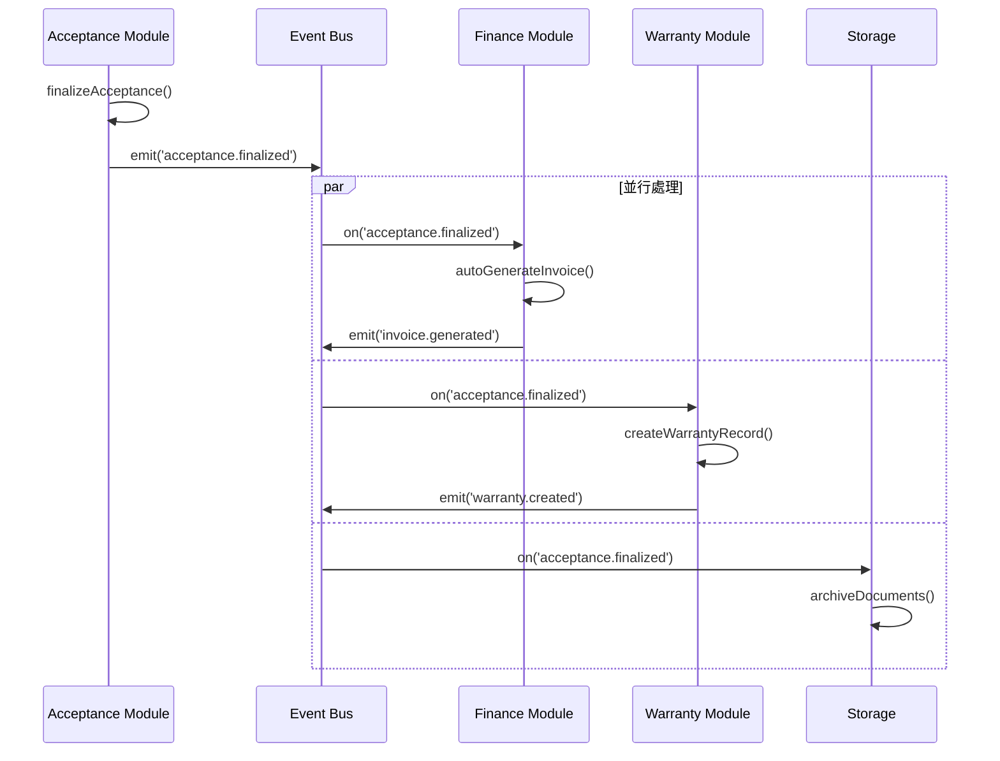

# SETC-059: Acceptance Conclusion Service

> **任務編號**: SETC-059  
> **模組**: Acceptance Module (驗收模組)  
> **優先級**: P1 (Important)  
> **預估工時**: 2 天  
> **依賴**: SETC-058  
> **狀態**: 📋 待開始

---

## 📋 任務概述

### 目標
實作驗收結論服務，管理最終驗收判定、證書生成、資料封存，並觸發後續的保固和請款流程。

### 範圍
- 最終驗收結論判定
- 驗收證書生成
- 保固條款設定
- 資料封存
- 觸發財務與保固流程

---

## 🔄 SETC 關鍵控制點

驗收結論是 SETC 工作流程中的關鍵控制點，完成後會觸發：
1. **請款生成** - 自動生成可請款清單
2. **保固建立** - 自動建立保固記錄
3. **資料封存** - 驗收相關文件歸檔



---

## 🏗️ 技術實作

### 服務介面

```typescript
import { Observable } from 'rxjs';

export interface IAcceptanceConclusionService {
  // 結論管理
  generateConclusion(
    requestId: string, 
    data: GenerateConclusionInput
  ): Promise<AcceptanceConclusion>;
  
  updateConclusion(
    id: string, 
    data: UpdateConclusionInput
  ): Promise<AcceptanceConclusion>;
  
  // 最終決定
  finalizeAcceptance(
    id: string, 
    decision: FinalDecision
  ): Promise<AcceptanceConclusion>;
  
  // 證書
  issueCertificate(
    conclusionId: string, 
    type: CertificateType
  ): Promise<Certificate>;
  
  // 保固
  setWarrantyTerms(
    conclusionId: string, 
    warranties: WarrantyItem[]
  ): Promise<AcceptanceConclusion>;
  
  // 簽核
  addFinalSignature(
    id: string, 
    signature: FinalSignatureInput
  ): Promise<void>;
  
  // 查詢
  getConclusion(id: string): Promise<AcceptanceConclusion | null>;
  getConclusionByRequest(requestId: string): Observable<AcceptanceConclusion | null>;
  
  // 報告
  generateFinalReport(id: string): Promise<string>;
  generateSummaryReport(id: string): Promise<string>;
}

export interface GenerateConclusionInput {
  preliminaryAcceptanceId: string;
  reinspectionIds?: string[];
  finalDecision: FinalDecision;
  acceptanceDate: Date;
  scope: AcceptanceScope;
  workItemsSummary: WorkItemSummary[];
  acceptedAmount: number;
  retainageAmount?: number;
  warranties?: WarrantyItem[];
}

export type FinalDecision = 'accepted' | 'conditionally_accepted' | 'rejected';

export interface WarrantyItem {
  itemName: string;
  description: string;
  warrantyPeriod: number; // 月
  warrantyConditions?: string[];
}

export type CertificateType = 
  | 'acceptance_certificate'
  | 'completion_certificate'
  | 'test_certificate';
```

### 服務實作

```typescript
import { Injectable, inject } from '@angular/core';
import { Observable } from 'rxjs';
import { AcceptanceConclusionRepository } from '../repositories/conclusion.repository';
import { PreliminaryAcceptanceRepository } from '../repositories/preliminary.repository';
import { ReinspectionRepository } from '../repositories/reinspection.repository';
import { IEventBus } from '@core/blueprint/platform/event-bus';
import { 
  IAcceptanceConclusionService,
  AcceptanceConclusion,
  GenerateConclusionInput,
  FinalDecision,
  Certificate
} from './conclusion.interface';

@Injectable({ providedIn: 'root' })
export class AcceptanceConclusionService implements IAcceptanceConclusionService {
  private repository = inject(AcceptanceConclusionRepository);
  private preliminaryRepo = inject(PreliminaryAcceptanceRepository);
  private reinspectionRepo = inject(ReinspectionRepository);
  private eventBus = inject(IEventBus);

  /**
   * 生成驗收結論
   */
  async generateConclusion(
    requestId: string,
    data: GenerateConclusionInput
  ): Promise<AcceptanceConclusion> {
    const conclusionNumber = await this.generateConclusionNumber();
    
    // 取得相關記錄
    const preliminary = await this.preliminaryRepo.findById(data.preliminaryAcceptanceId);
    const reinspections = data.reinspectionIds 
      ? await Promise.all(data.reinspectionIds.map(id => this.reinspectionRepo.findById(id)))
      : [];
    
    // 計算統計資料
    const totalDefectsFound = preliminary?.defectsFound || 0;
    const totalDefectsResolved = reinspections.reduce(
      (sum, r) => sum + (r?.resolvedDefects || 0), 0
    );
    
    // 計算保固期
    const warrantyStartDate = data.acceptanceDate;
    const maxWarrantyMonths = Math.max(
      ...((data.warranties || []).map(w => w.warrantyPeriod)),
      12 // 最少 12 個月
    );
    const warrantyEndDate = new Date(warrantyStartDate);
    warrantyEndDate.setMonth(warrantyEndDate.getMonth() + maxWarrantyMonths);
    
    const conclusion = await this.repository.create({
      requestId,
      blueprintId: preliminary?.blueprintId || '',
      conclusionNumber,
      preliminaryAcceptanceId: data.preliminaryAcceptanceId,
      reInspectionIds: data.reinspectionIds,
      totalInspectionRounds: 1 + (reinspections.length || 0),
      finalDecision: data.finalDecision,
      acceptanceDate: data.acceptanceDate,
      effectiveDate: data.acceptanceDate,
      scope: data.scope,
      workItemsSummary: data.workItemsSummary,
      totalDefectsFound,
      totalDefectsResolved,
      outstandingDefects: totalDefectsFound - totalDefectsResolved,
      acceptedAmount: data.acceptedAmount,
      retainageAmount: data.retainageAmount,
      warranties: data.warranties,
      warrantyPeriodStart: warrantyStartDate,
      warrantyPeriodEnd: warrantyEndDate,
      certificates: [],
      finalSignatures: []
    });
    
    this.eventBus.emit('acceptance.conclusion_generated', {
      conclusionId: conclusion.id,
      requestId,
      decision: data.finalDecision,
      timestamp: new Date()
    });
    
    return conclusion;
  }

  /**
   * 最終確定驗收 ⭐ SETC 關鍵控制點
   */
  async finalizeAcceptance(
    id: string,
    decision: FinalDecision
  ): Promise<AcceptanceConclusion> {
    const conclusion = await this.repository.findById(id);
    if (!conclusion) {
      throw new Error(`Conclusion ${id} not found`);
    }
    
    // 驗證簽核完整性
    if (!this.validateSignatures(conclusion)) {
      throw new Error('All required signatures must be collected');
    }
    
    const updated = await this.repository.update(id, {
      finalDecision: decision,
      finalizedAt: new Date()
    });
    
    // ⭐ 發送 SETC 關鍵事件
    // 此事件會觸發：
    // 1. Finance Module 自動生成請款單
    // 2. Warranty Module 自動建立保固記錄
    this.eventBus.emit('acceptance.finalized', {
      conclusionId: id,
      requestId: conclusion.requestId,
      blueprintId: conclusion.blueprintId,
      finalDecision: decision,
      acceptedAmount: conclusion.acceptedAmount,
      retainageAmount: conclusion.retainageAmount,
      warranties: conclusion.warranties,
      warrantyPeriodStart: conclusion.warrantyPeriodStart,
      warrantyPeriodEnd: conclusion.warrantyPeriodEnd,
      workItemsSummary: conclusion.workItemsSummary,
      timestamp: new Date()
    });
    
    console.log('[ConclusionService] Acceptance finalized (SETC key point):', id);
    
    return updated;
  }

  /**
   * 發行證書
   */
  async issueCertificate(
    conclusionId: string,
    type: CertificateType
  ): Promise<Certificate> {
    const conclusion = await this.repository.findById(conclusionId);
    if (!conclusion) {
      throw new Error(`Conclusion ${conclusionId} not found`);
    }
    
    const certificate: Certificate = {
      id: `cert-${Date.now()}`,
      type,
      name: this.getCertificateName(type),
      certificateNumber: await this.generateCertificateNumber(type),
      issueDate: new Date(),
      issuedBy: 'system', // TODO: 從 AuthService 取得
      fileUrl: '' // TODO: 生成 PDF
    };
    
    const certificates = [...(conclusion.certificates || []), certificate];
    
    await this.repository.update(conclusionId, { certificates });
    
    this.eventBus.emit('acceptance.certificate_issued', {
      conclusionId,
      certificateId: certificate.id,
      certificateType: type,
      timestamp: new Date()
    });
    
    return certificate;
  }

  /**
   * 設定保固條款
   */
  async setWarrantyTerms(
    conclusionId: string,
    warranties: WarrantyItem[]
  ): Promise<AcceptanceConclusion> {
    const conclusion = await this.repository.findById(conclusionId);
    if (!conclusion) {
      throw new Error(`Conclusion ${conclusionId} not found`);
    }
    
    // 重新計算保固期
    const maxMonths = Math.max(...warranties.map(w => w.warrantyPeriod));
    const warrantyEndDate = new Date(conclusion.warrantyPeriodStart!);
    warrantyEndDate.setMonth(warrantyEndDate.getMonth() + maxMonths);
    
    const updated = await this.repository.update(conclusionId, {
      warranties,
      warrantyPeriodEnd: warrantyEndDate
    });
    
    return updated;
  }

  /**
   * 新增最終簽核
   */
  async addFinalSignature(
    id: string,
    signature: FinalSignatureInput
  ): Promise<void> {
    const conclusion = await this.repository.findById(id);
    if (!conclusion) {
      throw new Error(`Conclusion ${id} not found`);
    }
    
    const finalSignature: FinalSignature = {
      ...signature,
      signedAt: new Date()
    };
    
    const signatures = [...(conclusion.finalSignatures || []), finalSignature];
    
    await this.repository.update(id, { finalSignatures: signatures });
  }

  /**
   * 生成最終報告
   */
  async generateFinalReport(id: string): Promise<string> {
    const conclusion = await this.repository.findById(id);
    if (!conclusion) {
      throw new Error(`Conclusion ${id} not found`);
    }
    
    // TODO: 使用報表服務生成 PDF
    const reportUrl = `/reports/conclusion/${id}/final-report.pdf`;
    
    await this.repository.update(id, {
      finalReportUrl: reportUrl
    });
    
    return reportUrl;
  }

  // ============ Private Methods ============

  private async generateConclusionNumber(): Promise<string> {
    const year = new Date().getFullYear();
    const random = Math.floor(Math.random() * 10000);
    return `AC-${year}-${String(random).padStart(4, '0')}`;
  }

  private async generateCertificateNumber(type: CertificateType): Promise<string> {
    const prefix = type === 'acceptance_certificate' ? 'ACC' : 
                   type === 'completion_certificate' ? 'CMP' : 'TST';
    const year = new Date().getFullYear();
    const random = Math.floor(Math.random() * 100000);
    return `${prefix}-${year}-${String(random).padStart(5, '0')}`;
  }

  private getCertificateName(type: CertificateType): string {
    const names: Record<CertificateType, string> = {
      acceptance_certificate: '驗收證明',
      completion_certificate: '完工證明',
      test_certificate: '測試證明'
    };
    return names[type];
  }

  private validateSignatures(conclusion: AcceptanceConclusion): boolean {
    // TODO: 驗證必要簽核是否完整
    return true;
  }
}
```

---

## ✅ 交付物

- [ ] `conclusion.service.ts`
- [ ] `conclusion.interface.ts`
- [ ] `conclusion.service.spec.ts`
- [ ] 更新 `index.ts` 匯出

---

## 🎯 驗收標準

1. ✅ 驗收結論生成正確
2. ✅ 證書發行功能完整
3. ✅ 保固條款設定正確
4. ✅ SETC 關鍵事件正確觸發
5. ✅ 後續流程自動啟動
6. ✅ 單元測試覆蓋率 >80%

---

**文件版本**: 1.0.0  
**建立日期**: 2025-12-15  
**最後更新**: 2025-12-15
