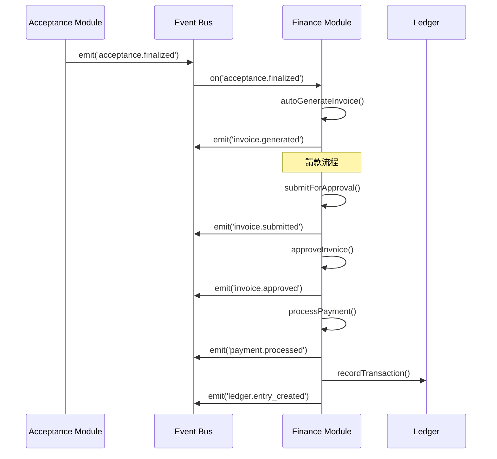

# SETC-062: Finance Module Enhancement Planning

> **任務編號**: SETC-062  
> **模組**: Finance Module (財務模組)  
> **優先級**: P1 (Important)  
> **預估工時**: 1 天  
> **依賴**: 現有 Finance Module 基礎實作  
> **狀態**: 📋 待開始

---

## 📋 任務概述

### 目標
規劃 Finance Module 的擴展架構，完善現有基礎實作，建立完整的財務管理系統，與 SETC 工作流程完全整合。

### 範圍
- 分析現有 Finance Module 實作狀態
- 識別待實作的功能模塊
- 設計擴展架構與資料模型
- 定義與其他模組的事件整合方案
- 制定實作計畫與驗收標準

---

## 🔍 現有實作分析

### 已完成功能
根據 `src/app/core/blueprint/modules/implementations/finance/README.md`：

- ✅ 模組基礎結構 (`FinanceModule`, `module.metadata.ts`)
- ✅ 目錄結構規劃 (`models/`, `repositories/`, `services/`)
- ✅ Blueprint Container 整合準備

### 待實作功能
- 🔴 Cost Management Sub-Module (成本管理)
- 🔴 Invoice Sub-Module (請款)
- 🔴 Payment Sub-Module (付款)
- 🔴 Budget Sub-Module (預算)
- 🔴 Ledger Sub-Module (帳務)
- 🔴 Financial Report Sub-Module (財務報表)

---

## 🔄 SETC 工作流程整合

### 財務在 SETC 流程中的位置

```
階段三：財務階段
───────────────────
驗收完成？
    ↓
[EVENT: acceptance.finalized]
    ↓
生成可請款項目 / 請款金額 / 扣款資訊【自動】
    ↓
（可選）請款單調整【手動】
    ↓
請款送審【手動】
    ↓
請款審核【手動】
    ↓
請款通過？
    ├─ 否 → 退回調整【手動】 ↺ 送審
    └─ 是
↓
付款作業【自動 / 手動】
    ↓
財務結算【自動】
```

### 關鍵事件流程



---

## 🏗️ 架構設計

### 模組結構

```
finance/
├── finance.module.ts                 # Domain 主模塊
├── module.metadata.ts                # Domain 元資料
├── finance.routes.ts                 # Domain 路由配置
├── repositories/
│   ├── invoice.repository.ts         # 請款 Repository
│   ├── payment.repository.ts         # 付款 Repository
│   ├── budget.repository.ts          # 預算 Repository
│   └── ledger.repository.ts          # 帳務 Repository
├── services/
│   ├── cost-management.service.ts    # 成本管理
│   ├── invoice.service.ts            # 請款服務
│   ├── payment.service.ts            # 付款服務
│   ├── budget.service.ts             # 預算服務
│   ├── ledger.service.ts             # 帳務服務
│   ├── financial-report.service.ts   # 財務報表
│   └── finance-event.service.ts      # 事件整合
├── models/
│   ├── invoice.model.ts
│   ├── payment.model.ts
│   ├── budget.model.ts
│   └── ledger.model.ts
├── components/
│   ├── invoice-list/
│   ├── invoice-form/
│   ├── payment-list/
│   ├── budget-overview/
│   └── financial-dashboard/
├── config/
│   └── finance.config.ts
├── exports/
│   └── finance-api.exports.ts
└── index.ts
```

---

## 📊 擴展任務分解

### SETC-062 ~ SETC-069 任務清單

| SETC ID | 任務名稱 | 工時 | 依賴 |
|---------|---------|------|------|
| SETC-062 | Finance Module Enhancement Planning | 1 天 | - |
| SETC-063 | Finance Repository Implementation | 2 天 | SETC-062 |
| SETC-064 | Invoice Service | 2 天 | SETC-063 |
| SETC-065 | Payment Service | 2 天 | SETC-064 |
| SETC-066 | Budget Management Service | 2 天 | SETC-063 |
| SETC-067 | Ledger & Accounting Service | 2 天 | SETC-065 |
| SETC-068 | Finance Event Integration | 2 天 | SETC-067 |
| SETC-069 | Finance UI Components & Testing | 3 天 | SETC-068 |

**總計**: 8 個任務，16 天

---

## ✅ 交付物

### 文件交付
- [ ] Finance Module 擴展架構設計文檔
- [ ] 資料模型定義文檔
- [ ] API 契約定義
- [ ] 事件整合規格書
- [ ] 實作計畫與時程表

### 技術交付
- [ ] 更新 `finance/README.md`
- [ ] 更新模組元資料
- [ ] Firestore Collection 設計
- [ ] Security Rules 草案

---

## 🎯 驗收標準

1. ✅ 完成現有實作狀態分析報告
2. ✅ 制定完整的擴展架構設計
3. ✅ 定義所有資料模型與介面
4. ✅ 規劃事件整合方案
5. ✅ 建立 SETC-063 ~ SETC-069 任務文檔
6. ✅ 更新 SETC 主索引與追蹤文件

---

**文件版本**: 1.0.0  
**建立日期**: 2025-12-15  
**最後更新**: 2025-12-15
