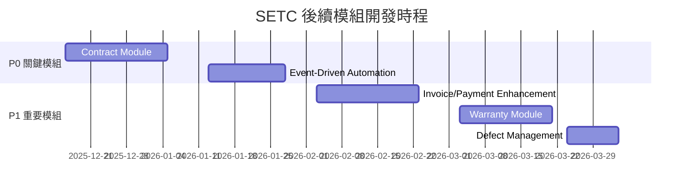

# SETC 後續模組開發規劃

> **文件版本**: 1.0.0  
> **建立日期**: 2025-12-15  
> **狀態**: 📋 規劃中  
> **基於**: SETC-ANALYSIS.md 完整性分析報告

---

## 📊 執行摘要

本文件基於 SETC.md 工作流程定義和 SETC-ANALYSIS.md 分析報告，為剩餘待開發模組制定詳細的 SETC（序列化可執行任務鏈）計畫。

### ✅ 已完成模組
1. **Issue Module** (問題模組) - SETC-001 ~ SETC-008 ✅ 完成
2. **Task Module** (任務模組) - 基礎實作完成 ✅
3. **Log Module** (施工日誌) - 已實作 ✅
4. **QA Module** (品質檢查) - 已實作 ✅
5. **Acceptance Module** (驗收模組) - 基礎實作完成 ✅
6. **Finance Module** (財務模組) - 基礎架構存在 ✅

### 📋 待開發模組（依優先級排序）

#### P0 - 關鍵模組（系統核心，必須優先完成）
1. **Contract Module** (合約管理模組) - 系統起點
2. **Event-Driven Automation** (事件驅動自動化) - 工作流程自動化

#### P1 - 重要模組（完善核心功能）
3. **Invoice/Payment Enhancement** (請款/付款功能強化)
4. **Warranty Module** (保固管理模組)
5. **Defect Management Integration** (缺失管理整合)

---

## 🎯 開發原則

### 奧卡姆剃刀定律應用

1. **KISS (Keep It Simple, Stupid)**
   - 避免過度設計
   - 優先實作核心功能
   - 延後次要功能

2. **YAGNI (You Aren't Gonna Need It)**
   - 不實作「可能需要」的功能
   - 專注當前需求
   - 避免預測性開發

3. **最小可行方案 (MVP/MVS)**
   - 先建立可運作的最小版本
   - 快速驗證核心流程
   - 逐步迭代優化

4. **單一職責原則 (SRP)**
   - 每個服務只負責一件事
   - 清楚的模組邊界
   - 避免上帝類別

5. **低耦合、高內聚**
   - 模組間透過事件總線通訊
   - 明確的 API 契約
   - 減少直接依賴

### Angular 20 現代化規範

✅ **必須遵循**:
- Standalone Components（無 NgModules）
- Signals 進行狀態管理
- 新控制流語法（@if, @for, @switch）
- inject() 函式注入
- input()/output() 取代裝飾器
- OnPush 變更檢測策略

✅ **架構模式**:
- 三層架構（UI → Service → Repository）
- Repository 模式統一資料存取
- 事件驅動架構（Event Bus）
- 上下文傳遞模式（Context Pattern）

### Firebase/Firestore 規範

✅ **資料存取**:
- 禁止元件直接呼叫 Firestore
- 必須透過 Repository 層
- 實作 Firestore Security Rules
- 使用 Snapshots 進行即時更新

✅ **安全性**:
- 所有 Collection 必須有 Security Rules
- 使用 rules_version = '2'
- 基於 request.auth 驗證身份
- 基於 resource.data 驗證權限

---

## 📋 模組開發 SETC 清單

### SETC-009 ~ SETC-016: Contract Module (合約管理模組)

**優先級**: P0 (Critical)  
**預估工時**: 4 週  
**依賴**: 無  
**影響範圍**: 整個系統的起點

#### 模組目標
實作完整的合約生命週期管理，作為整個 SETC 工作流程的起點。

#### SETC 任務分解

| 任務 ID | 任務名稱 | 工時 | 依賴 | 狀態 |
|---------|---------|------|------|------|
| SETC-009 | Contract Module 基礎設定 | 2 天 | - | 📋 待開始 |
| SETC-010 | Contract Repository 實作 | 2 天 | SETC-009 | 📋 待開始 |
| SETC-011 | Contract Management Service | 3 天 | SETC-010 | 📋 待開始 |
| SETC-012 | Contract Upload & Parsing Service | 3 天 | SETC-011 | 📋 待開始 |
| SETC-013 | Contract Status & Lifecycle Service | 2 天 | SETC-011 | 📋 待開始 |
| SETC-014 | Contract Work Items Management | 2 天 | SETC-011 | 📋 待開始 |
| SETC-015 | Contract Event Integration | 2 天 | SETC-013 | 📋 待開始 |
| SETC-016 | Contract UI Components | 2 天 | SETC-015 | 📋 待開始 |
| SETC-017 | Contract Testing & Integration | 2 天 | SETC-016 | 📋 待開始 |

**總計**: 8 個任務，20 天

#### 核心功能
1. ✅ 合約上傳（PDF/圖檔）
2. ✅ 合約建檔（基本資料、業主、承商）
3. ✅ 合約解析（OCR/AI - 可選延後）
4. ✅ 合約確認與人工補正
5. ✅ 合約狀態管理（draft → pending_activation → active → completed）
6. ✅ 合約工項管理
7. ✅ 合約與任務關聯驗證

#### 資料模型
```typescript
interface Contract {
  id: string;
  blueprintId: string;
  contractNumber: string;
  title: string;
  
  // 合約雙方
  owner: ContractParty;
  contractor: ContractParty;
  
  // 金額
  totalAmount: number;
  currency: string;
  
  // 工項
  workItems: ContractWorkItem[];
  
  // 狀態
  status: 'draft' | 'pending_activation' | 'active' | 'completed' | 'terminated';
  
  // 期限
  startDate: Date;
  endDate: Date;
  
  // 文件
  originalFiles: FileAttachment[];
  
  createdBy: string;
  createdAt: Date;
  updatedAt: Date;
}

interface ContractWorkItem {
  id: string;
  code: string;
  name: string;
  description: string;
  unit: string;
  quantity: number;
  unitPrice: number;
  totalPrice: number;
  
  // 執行狀態
  completedQuantity: number;
  completedAmount: number;
  completionPercentage: number;
}
```

#### 關鍵決策
- ⚠️ OCR/AI 解析功能**第一版不實作**，僅保留介面
- ✅ 專注於手動建檔和狀態管理
- ✅ 合約工項與任務的關聯驗證為核心功能
- ✅ 使用事件總線通知合約狀態變更

---

### SETC-018 ~ SETC-023: Event-Driven Automation (事件驅動自動化)

**優先級**: P0 (Critical)  
**預估工時**: 3 週  
**依賴**: Contract Module 基礎功能  
**影響範圍**: 跨階段自動化流程

#### 模組目標
實作完整的事件驅動自動化流程，實現 SETC.md 定義的自動節點。

#### SETC 任務分解

| 任務 ID | 任務名稱 | 工時 | 依賴 | 狀態 |
|---------|---------|------|------|------|
| SETC-018 | Event Bus 強化與事件類型定義 | 2 天 | - | 📋 待開始 |
| SETC-019 | Workflow Orchestrator 實作 | 3 天 | SETC-018 | 📋 待開始 |
| SETC-020 | 任務完成→日誌自動化 | 2 天 | SETC-019 | 📋 待開始 |
| SETC-021 | 日誌→QC 待驗自動化 | 2 天 | SETC-020 | 📋 待開始 |
| SETC-022 | QC→驗收/缺失自動化 | 3 天 | SETC-021 | 📋 待開始 |
| SETC-023 | 驗收→請款/保固自動化 | 3 天 | SETC-022 | 📋 待開始 |

**總計**: 6 個任務，15 天

#### 核心自動化流程

1. **任務完成 → 自動建立施工日誌**
   ```typescript
   eventBus.on('task.completed', async (data) => {
     await logApi.activityLog.autoCreateFromTask(data);
     eventBus.emit('log.created', { logId, taskId });
   });
   ```

2. **施工日誌建立 → 自動建立 QC 待驗**
   ```typescript
   eventBus.on('log.created', async (data) => {
     await qaApi.inspection.autoCreateFromLog(data);
     eventBus.emit('qc.pending_created', { inspectionId });
   });
   ```

3. **QC 不通過 → 自動建立缺失單**
   ```typescript
   eventBus.on('qc.inspection_failed', async (data) => {
     await qaApi.defect.autoCreateFromInspection(data);
     eventBus.emit('defect.created', { defectIds });
   });
   ```

4. **QC 通過 → 觸發驗收流程**
   ```typescript
   eventBus.on('qc.inspection_passed', async (data) => {
     const eligible = await acceptanceApi.checkEligibility(data.taskId);
     if (eligible) {
       await acceptanceApi.request.autoCreate(data);
       eventBus.emit('acceptance.request_created', { requestId });
     }
   });
   ```

5. **驗收通過 → 觸發請款流程**
   ```typescript
   eventBus.on('acceptance.finalized', async (data) => {
     if (data.finalDecision === 'accepted') {
       await financeApi.invoice.autoGenerateReceivable(data);
       await financeApi.payment.autoGeneratePayable(data);
     }
   });
   ```

6. **驗收通過 → 進入保固期**
   ```typescript
   eventBus.on('acceptance.finalized', async (data) => {
     if (data.finalDecision === 'accepted') {
       await warrantyApi.autoCreateFromAcceptance(data);
       eventBus.emit('warranty.period_started', { warrantyId });
     }
   });
   ```

#### 關鍵元件

**WorkflowOrchestrator** (工作流程編排器)
```typescript
export class SETCWorkflowOrchestrator {
  constructor(
    private eventBus: IEventBus,
    private tasksModule: ITasksModuleApi,
    private logModule: ILogModuleApi,
    private qaModule: IQAModuleApi,
    private acceptanceModule: IAcceptanceModuleApi,
    private financeModule: IFinanceModuleApi,
    private warrantyModule: IWarrantyModuleApi
  ) {
    this.setupEventHandlers();
  }
  
  private setupEventHandlers(): void {
    // 註冊所有自動化流程事件處理器
  }
}
```

---

### SETC-024 ~ SETC-030: Invoice/Payment Enhancement (請款/付款功能強化)

**優先級**: P1 (Important)  
**預估工時**: 4 週  
**依賴**: Contract Module, Event-Driven Automation  
**影響範圍**: 階段三（財務與成本）

#### 模組目標
擴展 Finance Module 的請款與付款功能，實作完整的審核流程。

#### SETC 任務分解

| 任務 ID | 任務名稱 | 工時 | 依賴 | 狀態 |
|---------|---------|------|------|------|
| SETC-024 | Invoice Service 擴展規劃 | 1 天 | - | 📋 待開始 |
| SETC-025 | Invoice Generation Service | 3 天 | SETC-024 | 📋 待開始 |
| SETC-026 | Invoice Approval Workflow | 3 天 | SETC-025 | 📋 待開始 |
| SETC-027 | Payment Generation Service | 3 天 | SETC-024 | 📋 待開始 |
| SETC-028 | Payment Approval Workflow | 3 天 | SETC-027 | 📋 待開始 |
| SETC-029 | Payment Status Tracking | 2 天 | SETC-028 | 📋 待開始 |
| SETC-030 | Invoice/Payment UI Components | 3 天 | SETC-029 | 📋 待開始 |
| SETC-031 | Finance Integration Testing | 2 天 | SETC-030 | 📋 待開始 |

**總計**: 8 個任務，20 天

#### 核心功能
1. ✅ 自動生成可請款清單（業主）
2. ✅ 自動生成可付款清單（承商）
3. ✅ 請款/付款審核流程（草稿→送出→審核→開票→收/付款）
4. ✅ 審核退回與補件機制
5. ✅ 自動更新任務款項狀態
6. ✅ 計入成本管理

#### 資料模型
```typescript
interface Invoice {
  id: string;
  blueprintId: string;
  invoiceNumber: string;
  invoiceType: 'receivable' | 'payable';
  
  // 關聯
  contractId: string;
  acceptanceId?: string;
  taskIds: string[];
  
  // 請款項目
  invoiceItems: InvoiceItem[];
  subtotal: number;
  tax: number;
  total: number;
  
  // 請款百分比
  billingPercentage: number;
  
  // 雙方
  billingParty: PartyInfo;
  payingParty: PartyInfo;
  
  // 狀態
  status: 'draft' | 'submitted' | 'under_review' | 'approved' | 'rejected' | 'paid';
  
  // 審核流程
  approvalWorkflow: ApprovalWorkflow;
  
  // 付款
  dueDate: Date;
  paidDate?: Date;
  paidAmount?: number;
  
  createdBy: string;
  createdAt: Date;
  updatedAt: Date;
}

interface ApprovalWorkflow {
  currentStep: number;
  totalSteps: number;
  approvers: Approver[];
  history: ApprovalHistory[];
}
```

---

### SETC-032 ~ SETC-038: Warranty Module (保固管理模組)

**優先級**: P1 (Important)  
**預估工時**: 3 週  
**依賴**: Acceptance Module, Event-Driven Automation  
**影響範圍**: 階段二後續（保固期管理）

#### 模組目標
實作完整的保固期管理與保固維修流程。

#### SETC 任務分解

| 任務 ID | 任務名稱 | 工時 | 依賴 | 狀態 |
|---------|---------|------|------|------|
| SETC-032 | Warranty Module 基礎設定 | 2 天 | - | 📋 待開始 |
| SETC-033 | Warranty Repository 實作 | 2 天 | SETC-032 | 📋 待開始 |
| SETC-034 | Warranty Period Management Service | 2 天 | SETC-033 | 📋 待開始 |
| SETC-035 | Warranty Defect Management Service | 3 天 | SETC-034 | 📋 待開始 |
| SETC-036 | Warranty Repair Management Service | 3 天 | SETC-035 | 📋 待開始 |
| SETC-037 | Warranty Event Integration | 2 天 | SETC-036 | 📋 待開始 |
| SETC-038 | Warranty UI Components | 2 天 | SETC-037 | 📋 待開始 |
| SETC-039 | Warranty Testing & Integration | 2 天 | SETC-038 | 📋 待開始 |

**總計**: 8 個任務，18 天

#### 核心功能
1. ✅ 驗收通過後自動建立保固記錄
2. ✅ 保固期追蹤與提醒
3. ✅ 保固缺失記錄
4. ✅ 保固維修管理
5. ✅ 保固期滿通知
6. ✅ 保固證明文件

#### 資料模型
```typescript
interface Warranty {
  id: string;
  blueprintId: string;
  acceptanceId: string;
  warrantyNumber: string;
  warrantyType: 'standard' | 'extended' | 'special';
  
  // 保固項目
  items: WarrantyItem[];
  
  // 保固期限
  startDate: Date;
  endDate: Date;
  periodInMonths: number;
  
  // 保固責任
  warrantor: string;
  contact: ContactInfo;
  
  // 狀態
  status: 'active' | 'expired' | 'voided';
  
  // 保固記錄
  defects: WarrantyDefect[];
  repairs: WarrantyRepair[];
  
  createdAt: Date;
  updatedAt: Date;
}

interface WarrantyDefect {
  id: string;
  warrantyId: string;
  defectNumber: string;
  description: string;
  location: string;
  severity: 'critical' | 'major' | 'minor';
  discoveredDate: Date;
  reportedBy: string;
  photos: string[];
  status: 'reported' | 'under_repair' | 'repaired' | 'verified' | 'closed';
  repairId?: string;
  createdAt: Date;
  updatedAt: Date;
}
```

---

### SETC-040 ~ SETC-044: Defect Management Integration (缺失管理整合)

**優先級**: P1 (Important)  
**預估工時**: 2 週  
**依賴**: QA Module, Issue Module  
**影響範圍**: 階段二（品質與驗收）

#### 模組目標
擴展 QA Module 的缺失管理功能，與 Issue Module 整合。

#### SETC 任務分解

| 任務 ID | 任務名稱 | 工時 | 依賴 | 狀態 |
|---------|---------|------|------|------|
| SETC-040 | Defect Service 擴展規劃 | 1 天 | - | 📋 待開始 |
| SETC-041 | Defect Lifecycle Service | 2 天 | SETC-040 | 📋 待開始 |
| SETC-042 | Defect Resolution Service | 2 天 | SETC-041 | 📋 待開始 |
| SETC-043 | Defect Reinspection Service | 2 天 | SETC-042 | 📋 待開始 |
| SETC-044 | Defect-Issue Integration | 2 天 | SETC-043 | 📋 待開始 |
| SETC-045 | Defect Testing & Integration | 1 天 | SETC-044 | 📋 待開始 |

**總計**: 6 個任務，10 天

#### 核心功能
1. ✅ QC 檢查失敗自動建立缺失單
2. ✅ 缺失整改流程
3. ✅ 缺失複驗機制
4. ✅ 嚴重缺失自動建立 Issue
5. ✅ 缺失統計與報表

---

## 📊 總體時程規劃

### 開發時程總覽



### 里程碑

| 里程碑 | 日期 | 交付內容 |
|--------|------|----------|
| M1: Contract Module 完成 | 2026-01-12 | 合約管理功能可用 |
| M2: Event Automation 完成 | 2026-02-02 | 自動化流程運作 |
| M3: Finance Enhancement 完成 | 2026-03-02 | 請款/付款完整流程 |
| M4: Warranty Module 完成 | 2026-03-23 | 保固管理功能可用 |
| M5: Defect Management 完成 | 2026-04-06 | 缺失管理完整整合 |

### 總計
- **總任務數**: 37 個 SETC 任務
- **總工時**: 83 天 (約 4 個月)
- **開發人員**: 1-2 人
- **預計完成**: 2026 年 4 月

---

## 🔄 實施流程

### 每個 SETC 任務的標準流程

1. **準備階段**
   - 閱讀任務定義文件
   - 查詢 Context7 獲取最新文檔
   - 使用 Sequential Thinking 分析技術方案
   - 使用 Software Planning Tool 制定計畫

2. **實作階段**
   - Repository 層（資料存取）
   - Service 層（業務邏輯）
   - Event 整合（事件總線）
   - UI 元件（使用者介面）

3. **測試階段**
   - 單元測試（80%+ 覆蓋率）
   - 整合測試（模組間互動）
   - E2E 測試（使用者流程）
   - 安全性測試（CodeQL）

4. **文件階段**
   - 更新模組 README
   - 更新 AGENTS.md
   - 更新架構圖
   - 記錄變更日誌

5. **交付階段**
   - Code Review
   - 合併到主分支
   - 部署到測試環境
   - 驗收確認

---

## ✅ 驗收標準

### 技術標準
- [ ] TypeScript 編譯無錯誤
- [ ] ESLint 檢查通過
- [ ] 測試覆蓋率 >80%
- [ ] 所有測試通過
- [ ] Firestore Security Rules 已部署
- [ ] 效能基準達標

### 功能標準
- [ ] 核心功能完整實作
- [ ] 邊界情況處理完整
- [ ] 錯誤處理完整
- [ ] 權限檢查完整
- [ ] 事件整合正確
- [ ] UI/UX 符合設計規範

### 文件標準
- [ ] README 完整
- [ ] API 文檔完整
- [ ] 架構圖已更新
- [ ] 變更日誌已記錄
- [ ] SETC 文件已完成

---

## 📚 參考文檔

### 專案文檔
- `SETC.md` - 工作流程定義
- `SETC-ANALYSIS.md` - 完整性分析報告
- `SETC-IMPLEMENTATION-INDEX.md` - Issue Module 實作索引
- `⭐.md` - 開發流程與規範

### 架構文檔
- `docs/archive/system/FINAL_PROJECT_STRUCTURE.md` - 專案結構
- `docs/GigHub_Architecture.md` - 系統架構

### 技術文檔
- Angular 20 官方文檔 - `/websites/angular_dev_v20`
- Firebase 官方文檔 - `/websites/firebase_google`
- TypeScript 5.9 文檔
- ng-alain 20.1 文檔
- ng-zorro-antd 20.3 文檔

---

## 🎯 下一步行動

### 立即行動（本週）
1. [ ] 建立 SETC-009 詳細文件（Contract Module 基礎設定）
2. [ ] 建立 SETC-010 詳細文件（Contract Repository）
3. [ ] 建立 SETC-011 詳細文件（Contract Management Service）
4. [ ] 準備開發環境與工具

### 短期目標（本月）
1. [ ] 完成 Contract Module SETC-009 ~ SETC-012
2. [ ] 建立 Contract Module 基礎架構
3. [ ] 實作合約 CRUD 功能
4. [ ] 完成合約上傳功能

### 中期目標（3 個月內）
1. [ ] 完成 Contract Module 全部功能
2. [ ] 完成 Event-Driven Automation
3. [ ] 完成 Invoice/Payment Enhancement
4. [ ] 系統自動化流程運作

### 長期目標（6 個月內）
1. [ ] 完成所有 P0 和 P1 模組
2. [ ] SETC.md 定義的工作流程完全實現
3. [ ] 系統上線運營
4. [ ] 持續優化與迭代

---

**文件維護**: GigHub Development Team  
**最後更新**: 2025-12-15  
**版本**: 1.0.0  
**狀態**: 📋 規劃中
